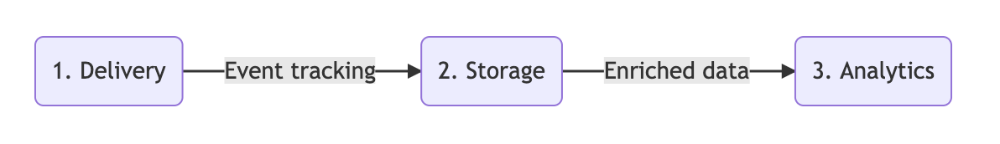

<p align="center"></p>

# Mojito

A modular, source-controlled split testing framework that lets you build, launch and analyse experiments via Git/CI.

It's comprised of 3 core modules e.g.: 

1. **[Mojito JS Delivery](https://github.com/mint-metrics/mojito-js-delivery)**: Front-end library for running experiments on your site.
2. **[Mojito Snowplow Storage](https://github.com/mint-metrics/mojito-snowplow-storage)**: Data models & events for tracking experiments.
3. **[Mojito R Analytics](https://github.com/mint-metrics/mojito-r-analytics)**: Templatable RMarkdown experiment reports.



## Features

- Under 5kb minified & gzipped
- Define experiments with simple JS or YAML
- Self-hosted & git-controlled for familiar code review / merging
- Expressive trigger system & utilities
- Variant code (JS/CSS) minification & linting
- Track and handle JS errors caused by your variant code

## Mojito vs. [vendor]

Differentiating features between popular vendors' tools and Mojito out of the box:

Feature | Optimizely X | Google Optimize | Mojito
--- | --- | --- | ---
Open-source license | ❌ | ❌ | ✅ BSD3
Light front-end codebase * | ❌~80kb | ❗~25kb | ✅<5kb
Git source control & CI | ❌ | ❌ | ✅
Variant error-tracking/handling | ❌ | ❌ | ✅
Auto CSS/JS minification | ❗([not custom code](https://community.optimizely.com/t5/Using-Optimizely/Minified-version-of-Optimizely-X-snippet/m-p/21411#M8655)) | ❓ | ✅
Self-hosted | ❗ (for a fee) | ❗(via API) | ✅
Data ownership | ❗(via S3 export) | ❗(via 360/BigQuery) | ✅
Retroactively add new metrics | ✅ | ❗(360 only) | ✅
Server-side/App testing | ✅ | ❗(via API) | ❗(via **Storage**)
WYSIWYG test editor | ✅ | ✅ | ❌

\* Tested 2019-07-05

## Getting started

Mojito consists of three components, which are often switched out in the course of Mint Metrics' client services:

1. **Delivery**: Front-end libraries to reliably control which treatments users are exposed to. e.g. [Mojito JS Delivery](https://github.com/mint-metrics/mojito-js-delivery)
2. **Storage**: Data collection modules and data modelling steps to power your reports. e.g. [Mojito Snowplow Storage](https://github.com/mint-metrics/mojito-snowplow-storage)
3. **Analytics**: Tools to measure & report on the effects caused by your treatments. e.g. [Mojito R Analytics](https://github.com/mint-metrics/mojito-r-analytics)

Get up and running quickly with the README files inside each section.

## Example experiment

Using Mojito's CI tools, you can set up experiments in YAML & JS:

```{yaml}
id: ex1
name: Example test 1
state: live
sampleRate: 0.75
trigger: trigger.js
recipes:
  0:
    name: Original
  1:
    name: Variant
    js: variant.js
    css: variant.css
```

Where ```trigger.js``` activates the experiment when a condition is met and a callback to activate is fired:

```{js}
function trigger(test) {
    if (document.location.pathname === '/') test.activate();
}
```

Upon activation, the will include 75% of traffic (```sampleRate: 0.75```) and split it 50-50 between "Original" and "Variant" groups.

For users assigned to the "Variant" group, we execute **a)** ```variant.js``` and **b)** ```variant.css``` files to transform the page through a **a)** JS function and **b)** CSS stylesheet respectively.

### After you've defined an experiment YAML...

Run the Gulp pipeline to lint/test/publish your container.

1. Install the necessary NPM packages: ```npm install```
2. Build & publish your testing container: ```gulp scripts-local && gulp publish```

## Example analytics reports

If you use our Snowplow/Redshift & R Analytics component for reporting, all your metrics can be reported on with a simple array of metrics.

```{r}
wave_params <- list(
  client_id = "mintmetrics",
  wave_id = "ex1",
  start_date = "2019-05-15 09:19:45",
  stop_date = "2019-06-05 14:29:00",
  time_grain = "hours",
  subject = "usercookie",
  recipes = c("Original", "Variant")
)

goalList <- list(
  list(
    title = "Transactions",
    goal = "purchase",
    operand = "="
  ),
  list(
    title = "Thankyou page views",
    goal = "page_view /contact/thank-you%",
    operand = "like"
  )
)
goalList <- mojitoFullKnit(wave_params, goal_list = goalList)
```

For this experiment, we'll report on transactions and page views:


## Support for other analytics back-ends

You don't exactly need Snowplow Analytics to use Mojito. You can also track experiments to wherever you like, via a custom storage adapter. E.g. To Google Tag Manager, Adobe etc.

You can even [hook Mojito Delivery up to Google Optimize's reports for free](https://mintmetrics.io/web-analytics/track-your-optimizely-vwo-tests-inside-google-optimize/).

## Credits

Our **Delivery** JS library is a heavily modified fork of the excellent [jamesyu/cohorts](https://github.com/jamesyu/cohorts) lib. Meanwhile we employ heavy use of the [Snowplow Analytics event pipeline](https://snowplowanalytics.com/) for our **Storage** component and [RStudio/Knitr](https://rmarkdown.rstudio.com/) for our **Analytics** reports.


## Getting involved

We would love to see PRs! We're able to assist if you hit any snags getting set up.

Reach out to us via: 

 - [Mint Metrics' website](https://mintmetrics.io/)
 - [Open an issue on Github](https://github.com/mint-metrics/mojito/issues/new)

